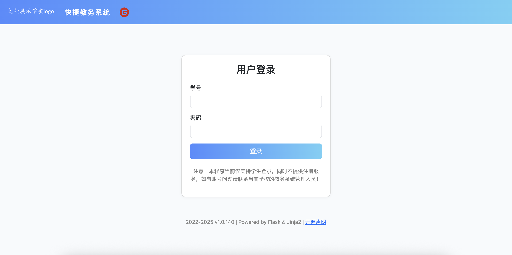
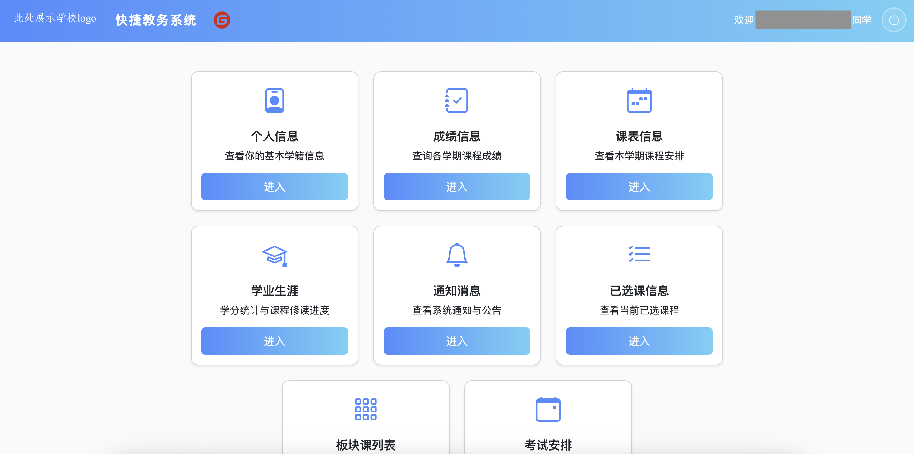

# Easy Educational Administration Management System (EasyEAM)
<a href="README.md">简体中文</a> | English
> - This version of the English README may not be the latest version. You can view the Chinese version.
## Project Overview

EasyEAM is a modern web-based educational administration system built with Flask and Jinja2. Students can log in via the web to view personal information, grades, class schedules, academic progress, notifications, course selection, and more. The UI is clean and user-friendly, suitable for self-service and secondary development.

The `api.py` file in this project is based on and adapted from <a href="https://github.com/openschoolcn/zfn_api">an excellent Zhengfang educational system API project</a> found on Github, with further modifications and optimizations for this system.

## Adaptation Instructions
This program has been adapted to PC Web end and mobile device Web end. However, because the educational administration system will detect whether an automated program is used, and will refuse access to the server, it is obvious that an error is reported after entering the student number and password: the educational administration system hangs up. If you can solve the problem that access to the server is denied by the educational administration system, you can contact me and kneel down~

## Version Instruction
The currently developed version is divided into "Developing Release version" and "Stable Release version". The Developing Release version is a preview version of the stable release version. Generally, new optimization ideas and new supported functions will be launched in the Developing Release version, while the stable release version is significantly optimized on the basis of the updated version to run more stably. For example, friends who are interested in new features can first experience the Developing Release version, and problems can be raised at any time.The following is a list of recommended versions.
<table>
   <th>
      Version Number
   </th>
   <th>
      recommendation
   </th>
   <tr>
      <th>
         v1.0.136 Stable
      </th>
      <th>Recommend! The Latest Stable Version</th>
   </tr>
   <tr>
      <th>
         v1.0.140 Developing
      </th>
      <th>Try Waiting ...</th>
   </tr>
</table>

## Main Features

- **User Login**: Supports student ID and password login, with captcha support when required.
- **Personal Info**: View student profile, academic status, and contact details.
- **Grade Inquiry**: Query grades by academic year/term, or view all grades for a year.
- **Class Schedule**: Display class schedule by year/term, including time, location, and instructor.
- **Academic Progress**: Visualize GPA, required/elective course completion, detailed course breakdown, and a pie chart for required courses.
- **Notifications**: View system notifications and announcements.
- **Selected Courses**: Check currently selected courses with details.
- **Block Courses**: Query available courses by block number.
- **Secure Logout**: One-click secure logout.
- **Examination Arrangement**: View the arrangement of the examination room of the current semester.




## Adapting to Other University Educational Systems

This system is developed based on the new Zhengfang educational administration system of Nantong Institute of Technology. As long as your university uses the **new Zhengfang system** (the new web-based version), you can use this program directly without modifying the core code.

### How to Switch to Your School's System

1. **Find your university's educational system URL**  
   The typical format is:
   ```
   https://zfjw.[your-school-domain]/jwglxt/
   ```
   For example:
   - Nantong Institute of Technology: `https://zfjw.ntit.edu.cn/jwglxt/`
   - For other schools, log in to your educational system in your browser and copy the address up to `/jwglxt/`.

2. **Modify the backend configuration**  
   Open `app.py` in the project root and find the following line (usually near the top):
   ```python
   BASE_URL = "https://zfjw.ntit.edu.cn/jwglxt/"
   ```
   Change it to your school's system URL, for example:
   ```python
   BASE_URL = "https://zfjw.[your-school-domain]/jwglxt/"
   ```

3. **Save and restart the service**  
   After saving `app.py`, restart Flask:
   ```bash
   python app.py
   ```

4. **Log in again**  
   Visit the homepage in your browser and log in with your student ID and password.

> **Notes:**  
> - Only the new Zhengfang system is supported (URL structure and page style similar to Nantong Institute of Technology).
> - If you encounter compatibility issues or interface changes, please open an issue or adapt the relevant interfaces in `api.py`.

### api.py Educational System API Adaptation Guide

Some schools' new Zhengfang systems may have slightly different interface paths, parameters, or login methods. You can adapt by modifying the `api.py` file.

#### 1. Main Adaptation Points
- BASE_URL: Main host address (see app.py)
- Login interface paths and parameters (e.g., login_url, key_url, kaptcha_url)
- Data interface paths (e.g., personal info, grades, schedule, notifications)
- Request parameter/field names (may differ in some schools)
- Captcha or encryption methods (some schools require special handling)

#### 2. How to Modify

**Step 1: Locate interface configuration**

Open `api.py`, and in the `Client` class's `__init__` method, find:

```python
self.base_url = kwargs.get("base_url")
self.key_url = urljoin(self.base_url, "xtgl/login_getPublicKey.html")
self.login_url = urljoin(self.base_url, "xtgl/login_slogin.html")
self.kaptcha_url = urljoin(self.base_url, "kaptcha")
# Other interface paths...
```

If your school's interface paths differ, modify them accordingly.

**Step 2: Adjust interface parameters**

If login parameter names differ (e.g., csrftoken, yhm, mm), adjust in the `login` and `login_with_kaptcha` methods:

```python
login_data = {
    "csrftoken": csrf_token,
    "yhm": sid,
    "mm": encrypt_password,
    # Other parameters if needed
}
```
Modify according to your school's actual interface documentation or captured requests.

**Step 3: Adjust data interfaces**

If grade, schedule, or personal info interface paths or parameters differ, find the corresponding `get_grade`, `get_schedule`, `get_info` methods and modify the `url` and `data` dictionaries.

**Step 4: Debug and verify**

- Use browser developer tools or packet capture tools (e.g., Fiddler, Charles) to compare your school's actual requests and responses.
- If you encounter errors or empty data, first check if the URL and parameters match the actual system.

**Step 5: Special adaptation if needed**

- Some schools may have custom encryption, captcha, or secondary authentication. Implement these in the corresponding methods as needed.
- For help, you can provide captured request info or interface docs to the developer.

---

#### Example: How to modify the login interface path

If your school's login interface is `/auth/login.html` and the public key interface is `/auth/getKey.html`, just modify the `__init__` method in `api.py`:

```python
self.key_url = urljoin(self.base_url, "auth/getKey.html")
self.login_url = urljoin(self.base_url, "auth/login.html")
```

---

#### Tips
- Most new Zhengfang systems have similar interface structures; usually, you only need to change the URL prefix.
- For complex adaptation, capture requests first and modify the code step by step.

## Installation & Usage

### 1. Clone the Repository

```bash
git clone https://gitee.com/JXX_CODE/easy-eam.git
cd easy-eam
```

### 2. Install Dependencies

Python 3.8+ is recommended. Use a virtual environment if possible.

```bash
pip install -r requirements.txt
```

### 3. Start the Server

```bash
python app.py
```

By default, visit `http://127.0.0.1:5000/` in your browser.

## Directory Structure

```
easy-eam/
├── app.py                # Flask main app
├── api.py                # Core logic for educational system
├── copyright.py          # Open source statement
├── requirements.txt      # Dependencies
├── static/               # Static resources (images, SVG, etc.)
├── templates/            # Frontend templates
└── README_en.md          # English documentation
```

## Usage Guide

1. After starting, open the homepage and log in with your student ID and password.
2. Upon successful login, access the main menu and click any feature card to enter the corresponding page.
3. Use the "Back to Menu" button at the top left of each page to return to the main menu.
4. The top bar displays the current student info; the right side provides a logout button.
5. The footer shows the open source statement; click to view details in a modal.


## Notes
- Do not deploy the project to the server, because the educational administration system will judge whether an automated program is used.
- This system is for learning and communication only. Commercial or illegal use is strictly prohibited.
- Only students with valid educational system accounts can use it.
- Login and operation logs only keep necessary info; sensitive data is never recorded.
- Logs are auto-cleaned, keeping only the most recent month.

## License

This project is licensed under the GNU GPL v3. See [copyright](./LICENSE).

---

For secondary development or questions, feel free to open an issue !
